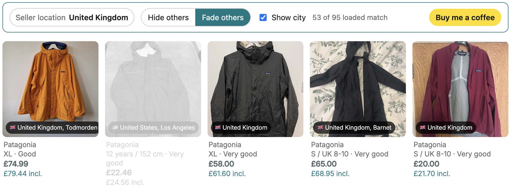
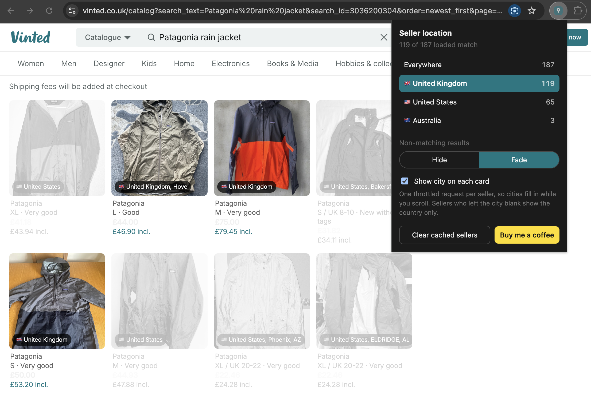

# Vinted Location Filter

A Chrome extension that filters Vinted search results by the seller's country.





Vinted sells across borders but gives you no way to filter by where the seller
is. On a UK search for "Patagonia rain jacket", 44 of the first 95 results were
sellers in the United States or Australia. Across six searches on vinted.se,
68% of results were Polish and only 19% were Swedish.

## How it finds the seller's country

Every result from Vinted's search API carries the price the seller set and the
currency they set it in:

```json
"conversion": { "seller_price": "55.0", "seller_currency": "USD",
                "buyer_currency": "GBP", "fx_rounded_rate": "0.75" }
```

Where a currency belongs to exactly one Vinted market, it names the seller's
country with no extra requests. GBP is the United Kingdom, SEK is Sweden, PLN
is Poland, DKK is Denmark. Items with no `conversion` block are priced in the
market's own currency, so on vinted.co.uk they are British and on vinted.se
they are Swedish.

This was checked against `/api/v2/users/{id}.country_code` on 44 sellers across
vinted.co.uk and vinted.se, and matched every time.

### Where it does not work

The euro breaks the trick. Around eighteen Vinted markets price in EUR, so on
vinted.de a German seller and a Dutch seller look identical: both have no
`conversion` block. A test search on vinted.de returned 95 results, all in the
native bucket, with sellers in both DE and NL.

On euro markets the currency tells you nothing, and the country has to come
from a seller lookup instead. That path is slow by design, see below.

## Cities, and why they are slow

`/api/v2/users/{id}` is the only endpoint that returns a seller's city, and it
starts refusing requests after about six rapid calls. A page of 96 results
would need 96 calls.

So cities are off by default. When you turn them on, lookups run one at a time
behind a delay, visible cards first, and every result is cached for 90 days.
Repeated refusals widen the delay and then stop the queue rather than retrying
into a ban. Cities fill in while you scroll instead of blocking the page.

Sellers can also leave the city blank, and it is free text when they do fill it
in, so treat city as a hint rather than a filter.

## What it does to the page

Vinted renders the catalogue on the server and pages it 96 results at a time,
so there is no client request to intercept and no infinite scroll to keep. The
extension calls the same search API itself and renders its own grid with
continuous scrolling, which also removes the paging.

Results that do not match are hidden, or faded if you prefer to keep seeing
them. A seller whose country could not be read is never hidden. It gets an
amber tag instead, so a filter cannot silently cost you a listing.

## Install

1. Clone this repository.
2. Open `chrome://extensions` and turn on developer mode.
3. Choose "Load unpacked" and select the `extension` folder.
4. Open any Vinted search. The picker sits above the results.

## Settings

The controls appear twice: in a bar above the results, and in the toolbar
popup. Both write to the same stored settings, so a change in one shows up in
the other. Use whichever is closer to hand.

Each lists only the countries present in the current search, with counts, so it
works on any Vinted market without a hardcoded country list. The popup also has
a button to clear cached sellers.

## Notes on rate limits

Vinted rate limits both endpoints this extension uses. Search pages load one at
a time as you scroll. Seller lookups are throttled, cached and capped. If you
see "seller lookups paused", Vinted has started refusing them and the queue has
stopped on purpose.

## Packaging

`python3 tools/package.py` writes `dist/vinted-location-filter-<version>.zip`,
taking the version from the manifest. The archive holds the contents of
`extension/` with `manifest.json` at its root, which is the layout the Chrome
Web Store expects. `dist/` is not tracked.

## Icons

`tools/make-icons.py` renders `extension/icons/*.png` from a small shape
definition, supersampled 8x8 per pixel so the edges are smooth at 16px. Run it
from the repository root after changing the shape.

## Licence

MIT, see [LICENSE](LICENSE).
